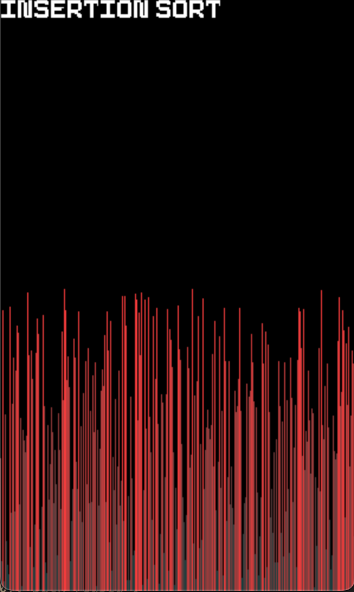

# Algo Visualiser

This is a simple sorting algorithm visualiser written in Python using Pygame. 

It supports three algorithms:

*  Insertion Sort
*  Bubble Sort
*  Quick Sort

---

## Usage

To **start** or **stop** the sorting animation, simply click the  **space bar**. 

To **select Insertion Sort**, click **1** on your keyboard.

To **select Bubble Sort**, click **2** on your keyboard.

To **select Quick Sort**, click **3** on your keyboard.

---

